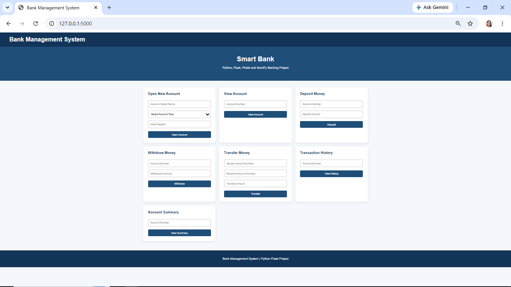
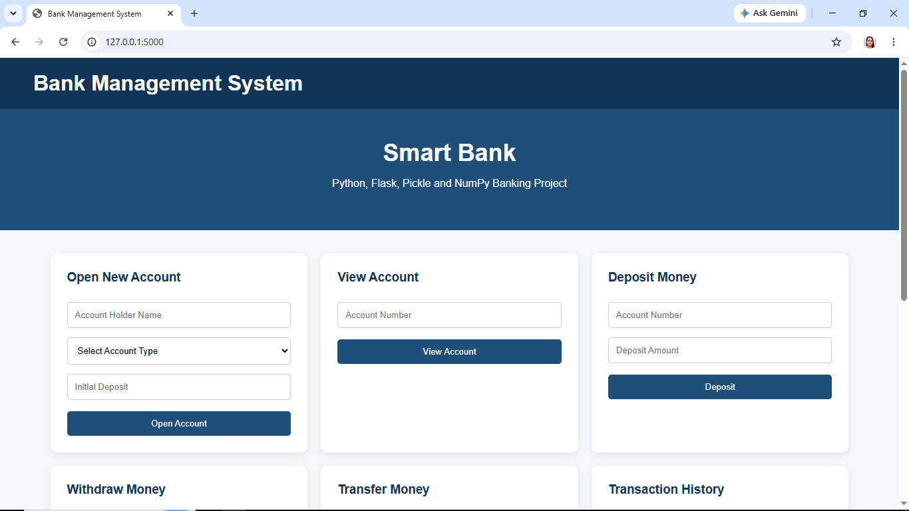
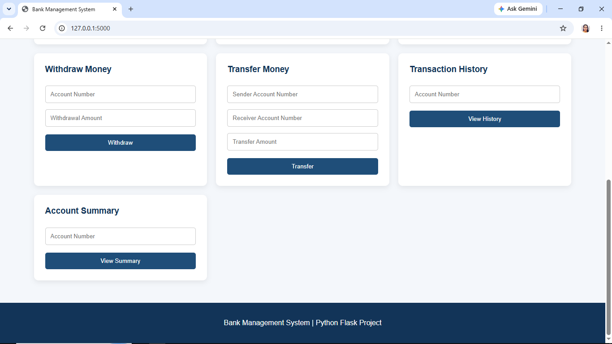
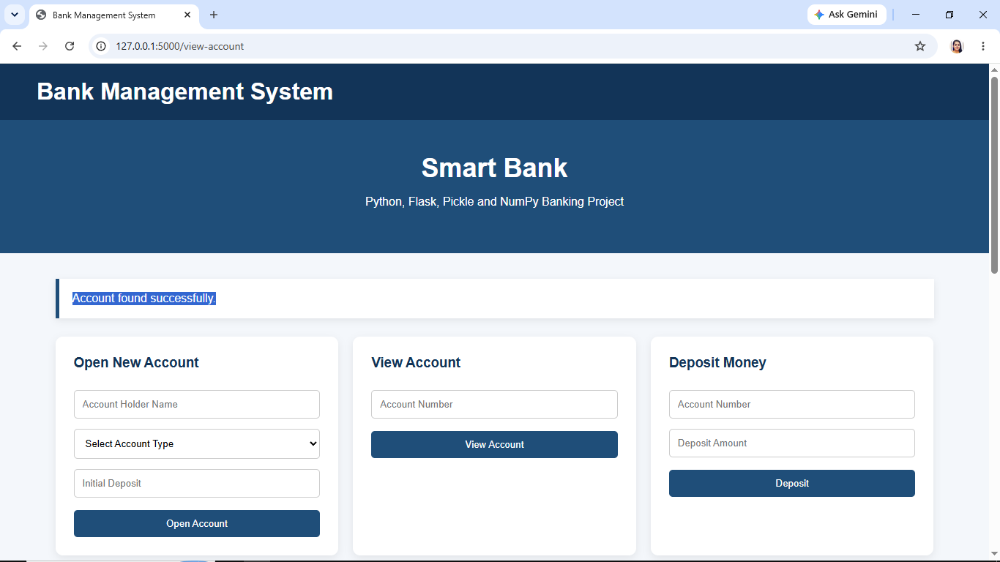
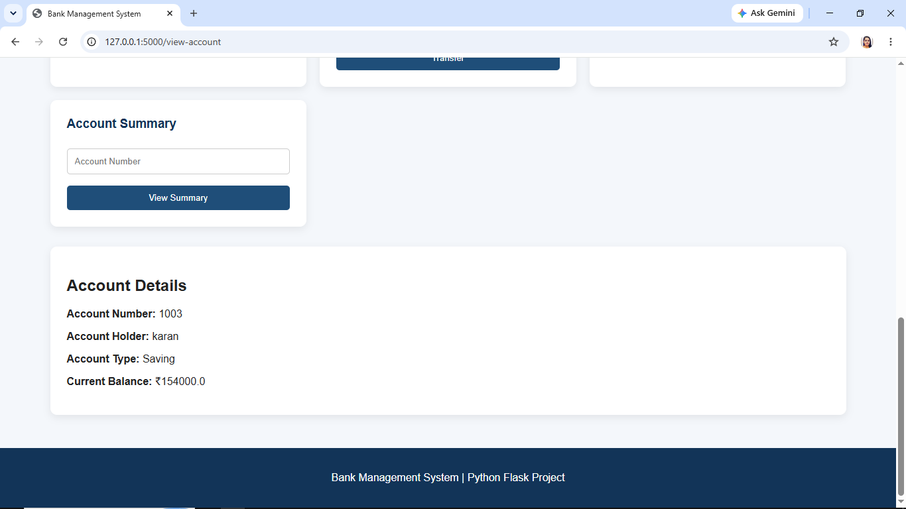
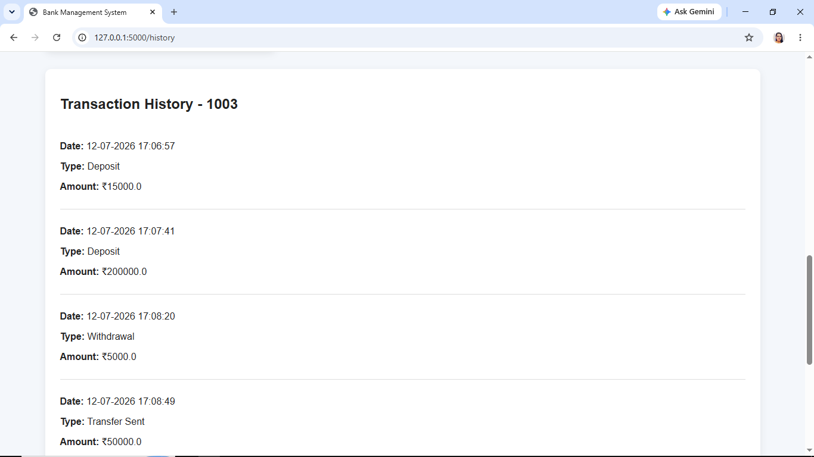
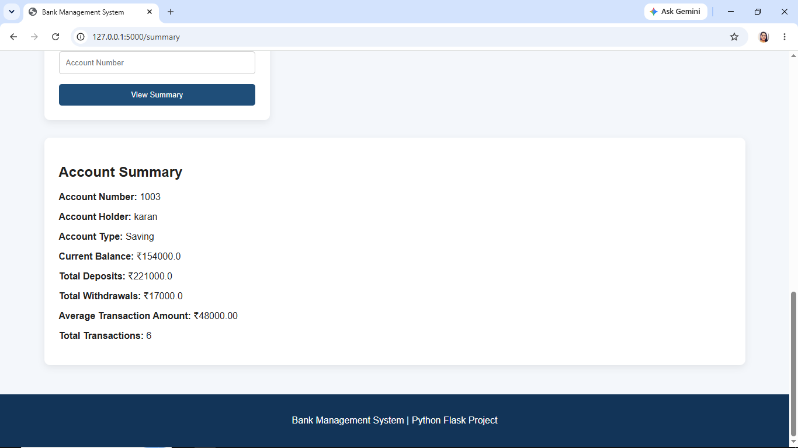

# Bank Management System

A Python and Flask-based Bank Management System that allows users to create bank accounts,
 deposit and withdraw money,
  transfer funds,
   view transaction history,
    and generate account summaries.

## Features

- Open a new bank account
- View account details
- Deposit money
- Withdraw money
- Transfer money between accounts
- View transaction history
- Generate account summaries
- Persistent data storage using Pickle
- Transaction analysis using NumPy
- Input validation and error handling
- Web interface using Flask and HTML

## Technologies Used

- Python
- Flask
- NumPy
- Pickle
- HTML
- CSS

## Project Structure

Bank_Management_System/
│
├── app.py
├── bank.py
├── requirements.txt
├── README.md
├── .gitignore
│
└── templates/
    └── index.html

## How to Run the Project

1. Clone the repository.

2. Open the project folder.

3. Install the required libraries:

pip install -r requirements.txt

4. Run the Flask application:

python app.py

5. Open the local Flask URL in your browser.

## Banking Operations

The application supports account creation, deposits, withdrawals, transfers, transaction history, and account summary generation.

Account data is stored locally using Python Pickle.

## Account Summary

NumPy is used to calculate:

- Total deposits
- Total withdrawals
- Average transaction amount
- Total number of transactions

## Project Screenshots

### Bank Management System Dashboard

### Account Details

### Transaction History

### Account Summary

## Author

Aarti Parihar

